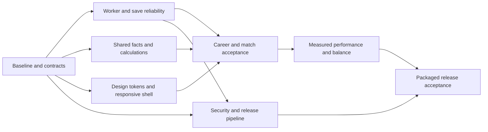

# Execution plan and complete audit backlog

**13 September execution update:** use the [Windows 1.0 launch plan](../launch-readiness/README.md) and its 36 master prompts for current sequencing and state. [Every package below is mapped forward](../launch-readiness/LEGACY-CROSSWALK.md). The detailed criteria and original estimates below are retained as historical inputs, not current release certification or an estimate of the expanded spatial-simulation scope.

Baseline: 12 September 2026, commit `f0c1f814`. This is a proposed implementation program. **None of the unchecked tasks below is represented as completed by the audit.** See [AUDIT.md](AUDIT.md) for evidence and [COVERAGE.md](COVERAGE.md) for screen-by-screen acceptance work.

**Current progress:** [first cleanup implementation](IMPLEMENTATION.md) records changes, validation and remaining acceptance. Partially implemented packages remain unchecked.

## 1. Direction and scope

Make the existing game trustworthy, readable, and easy to maintain. Preserve working simulation systems, career progress, and the regression suite. Pause unrelated feature expansion until the core career loop and release gates are dependable.

A professional result means:

- The same fact has the same value and name everywhere. Income, OVR, dates, eligibility, and map names have explicit definitions.
- Progression and save operations complete once, recover predictably, and tell the player what happened.
- A player can start a career, understand the next decision, play a match, and return later without guessing how the interface works.
- Every supported screen size exposes essential actions. Typography, keyboard behavior, motion, and feedback follow a shared standard.
- A packaged release is built and checked through one repeatable process, with actual Electron and Steam behavior verified separately from web/unit tests.
- A developer can find the authoritative implementation, understand its contract, and change it without tracing multiple competing stores or calculators.

This plan contains **60 work packages**. A package is a coherent deliverable; split large packages into implementation tickets after inspecting the affected code. The route and scenario matrices add acceptance cases, rather than a second competing backlog.

## 2. Order, dependencies, and effort

| Phase | Outcome | Packages | Rough engineering effort |
|---|---|---|---|
| 0 | One backlog, repeatable evidence, agreed product rules | 01–04 | 1–3 working days |
| 1 | Reliable progression, persistence, preferences, and close behavior | 05–14 | 7–12 days |
| 2 | Consistent calculations and player-facing facts | 15–20 | 4–7 days |
| 3 | Readable, accessible, responsive shared interface | 21–29 | 6–10 days |
| 4 | Coherent management and match journeys | 30–39 | 8–14 days |
| 5 | Safer platform and maintainable code boundaries | 40–47 | 6–11 days |
| 6 | Owned content and measured performance | 48–53 | 4–8 days |
| 7 | Release gates, integration coverage, and acceptance | 54–60 | 5–9 days, plus external release testing |

These are planning ranges for someone familiar with the code, not a quote or delivery promise. Taken sequentially, the full scope is roughly 8–15 engineering weeks; design iteration, hardware access, Steam review, and newly discovered defects can extend it. Begin with the first two phases and re-estimate from actual throughput. Do not postpone security triage or integration harness work until their table position: start **40, 41, 54, and 55** alongside the first fixes.

Sizes below are relative: **S** usually under a day, **M** roughly 1–3 days, **L** roughly 3–5 days; larger discoveries should become separate tickets. Phase estimates allow shared work and are not sums of every upper bound. “Engineering,” “design,” and “QA” describe responsibilities and may be the same person; they do not assume an existing team.

Dependency chain:

## 3. First implementation batch

The first batch should produce a small, reviewable set of fixes rather than a new look for every page:

1. Establish the regression harness and failing cases for the worker response, dropped durable field, and conflicting finance projection (01, 05, 07, 15).
2. Repair worker correlation and unify the durable commit boundary (05–07). Prove that fallback and normal processing produce the same committed state.
3. Make close/cancel/autosave behavior coherent and expose one autosave preference (09–11).
4. Make the two finance screens use the same projection and fix the clipped progression controls (15, 22).
5. Triage runtime dependencies and restrict the Electron server/IPC boundaries (40–41).

This batch addresses the highest trust and usability risks. Typography, navigation, and page redesign follow once those contracts are stable. Keep each pull request scoped to one behavior or tightly coupled contract; a phase is not one giant pull request.

## 4. Checkable work packages

### Phase 0 — establish a single working baseline

- [ ] **01 — Turn reproduced defects into focused regression cases.** Priority P1; M; engineering. Depends: none. Findings F01–F09. Promote the useful cases from the audit probes into maintained tests for worker timeout/late response, durable snapshot fields, and pre-initialization audio settings. Add a fixture that exposes competing finance totals. **Accept:** each test fails against the original defect, passes after its fix, and checks observable behavior rather than private implementation details. Keep the current 1,163-test baseline green.
- [ ] **02 — Make the current backlog authoritative.** P2; S; engineering/product. Depends: none. F25. Use these IDs to consolidate actionable items from the June audits; classify each old item as fixed, still open, superseded, or investigation with evidence. Update README, TASK, and developer/release entry points; label historical reports clearly. **Accept:** one current priority queue, one development workflow, and no stale PR/branch status presented as current. Documentation claims match scripts and supported features.
- [ ] **03 — Write short product contracts for disputed facts.** P1; M; product/engineering. Depends: none. F01, F11–F15, F28. Define forecast versus booked cash, OVR semantics, starting-team eligibility, day/week/season numbering, canonical display names, and training slot capacity. Record defaults and exceptions. **Accept:** each definition names its source of truth and the screens that consume it; uncertainties become explicit decisions rather than hidden UI differences.
- [ ] **04 — Establish reproducible test careers and acceptance targets.** P1; M; engineering/QA. Depends: 03 for product assertions. F23, F27–F28. Create seeded small/medium/large saves and first-week, season-boundary, financially stressed, modded, and late-career fixtures. Preserve representative older save versions. Specify supported resolution, scaling, input methods, OS, and minimum hardware from the intended product requirements. **Accept:** fixtures can be recreated without private saves; scenario checks and measured performance results identify seed, build, hardware, and settings.

### Phase 1 — progression and save trust

- [ ] **05 — Repair the worker request lifecycle.** P1; M; engineering. Depends: 01. F02. Correlate every request/result/error, remove listeners and timers on every exit, and prevent late messages from satisfying another request. Handle runtime worker errors and `postMessage` failures. Choose whether timeout terminates/replaces the worker and enforce that policy. **Accept:** timeout then next request, out-of-order results, worker crash, initialization failure, cancellation/disposal, and repeated calls produce only the correct result with no leaked listeners or double completion.
- [ ] **06 — Unify weekly computation and commit ownership.** P1; L; engineering. Depends: 05. F03. Make worker and synchronous fallback obey the same computation contract. Let one application coordinator own store reconciliation and the final durable write. Include all post-processing in the committed result and represent computation, committing, completion, and failure explicitly. **Accept:** equivalent input and captured RNG produce equivalent results in both paths; injected failures before/after reconciliation never report an uncommitted week as safely saved or apply a week twice.
- [ ] **07 — Create one typed durable-save serializer.** P1; M; engineering. Depends: 03; coordinate with 06. F04. Replace separate snapshot/manual-save builders with one schema-bound serializer. Include `lastCommittedWeekTick`; decide and implement the lifecycle of custom tactics, in-progress matches, and pending weekly actions. Distinguish career state, device preferences, and disposable UI state. **Accept:** all save entry points serialize the same durable contract; loading into a fresh store preserves the declared fields and excludes temporary errors/loading flags. Existing versions still load through migrations.
- [ ] **08 — Verify recovery, migration, and backup behavior end to end.** P1; L; engineering/QA. Depends: 06–07, 55. F04, F23. Exercise real browser storage and packaged storage with quota failure, failed write, interrupted commit, corrupted primary with valid backup, incompatible version, and migration failure. Keep errors actionable and preserve a recoverable copy. **Accept:** original valid data survives failed writes/migrations; recovery offers a clear choice; repeat load does not duplicate transactions, rewards, or simulation ticks. Test the actual adapters, not only an in-memory fake.
- [ ] **09 — Replace conflicting close timers with one close protocol.** P1; M; engineering. Depends: 06–07. F05. Distinguish a responsive app waiting for a player choice from an unresponsive renderer. Coordinate Electron close requests, active simulation, save completion, retry, cancel, and explicitly chosen discard. **Accept:** waiting more than 15 seconds at a responsive save-failure dialog does not force-close the game; closing during a slow save or week tick has a documented, tested outcome; repeated close requests do not create competing dialogs or writes.
- [ ] **10 — Repair autosave and close-listener lifecycle.** P1; M; engineering. Depends: 09. F06. Own timers/listeners in a lifecycle-safe service or hook; provide IPC listener unsubscribe; avoid stale closures and permanent registration flags. **Accept:** canceling close resumes autosave, Strict Mode remount does not duplicate handlers, theme/preference changes do not strand a timer, and shutdown cleans up exactly once.
- [ ] **11 — Consolidate persistent preferences.** P1; M; engineering. Depends: 03. F07. Choose one settings store and migrate old values deterministically. Make the settings page, menu/modal, and runtime services consume it. Separate per-device settings from per-career options and explain reset scope. **Accept:** changing autosave in either surface immediately changes actual behavior and appears in the other; a fresh session retains it; migration precedence and reset behavior are covered.
- [ ] **12 — Apply audio preferences throughout initialization and navigation.** P2; M; engineering/QA. Depends: 11. F08. Apply stored gains and toggles when the audio context is first created. Make scene transitions own music transitions; ordinary routes within a scene should not accidentally stop playback. **Accept:** muted/zero-volume starts stay silent after first interaction; menu-to-menu and career-to-menu navigation behave consistently; sliders and toggles take effect without reload; manually verify audible clipping and repetition.
- [ ] **13 — Clarify save and progression feedback.** P1; M; design/engineering. Depends: 06, 09, 11. F03–F07. Give the player accurate processing/saving/saved/failed states and last successful save time. Disable only incompatible actions during a transition, and distinguish manual save from autosave. **Accept:** the UI never says saved before durable completion; repeated Next Day/Skip Week/Save/Close inputs cannot queue accidental duplicate mutations; error recovery and cancel paths are keyboard accessible.
- [ ] **14 — Validate seeded replay through the real application path.** P1; L; engineering. Depends: 06–08, 04. F03, F23; historical determinism investigation. Compare repeated seeded runs through the actual store coordinator, worker and fallback, including save/reload between weeks. Separate cosmetic randomness if it changes simulation outcomes. **Accept:** agreed deterministic fields match across runs; unavoidable nondeterminism is explicitly isolated; match, financial, progression, and RNG results survive resume without duplication or drift.

### Phase 2 — consistent numbers, names, and time

- [ ] **15 — Use one financial projection and ledger contract.** P1; M; engineering. Depends: 01, 03. F01. Consolidate dashboard, Finances, hiring/transfer previews, sponsor forecasts, and weekly settlement around the authoritative economy rules. Show certain recurring items separately from conditional prize/sponsor income. **Accept:** the same save produces the same labeled totals on every screen; a controlled week's balance change reconciles to ledger items and clearly explained exceptions. Include facility costs, minimum revenue rules, wages, and sponsor conditions.
- [ ] **16 — Define and reuse OVR calculations.** P2; S/M; engineering/design. Depends: 03. F13. Use a shared selector or distinguish different ratings with explicit names and explanations. **Accept:** new-career selection, dashboard, squad, player profile, scouting, transfer cards, and comparison views agree for the same revealed data; hidden scouting knowledge has an intentional display rule.
- [ ] **17 — Centralize calendar presentation and season position.** P2; M; engineering. Depends: 03. F14. Use shared date/week/day/season helpers across schedule, match results, inbox, contract expiry, and dashboard. **Accept:** a day-three match shows day three, season progress resets at boundaries, and leap years, year rollover, postponed fixtures, and historical events display consistently.
- [ ] **18 — Enforce a canonical display-name registry.** P1; M; engineering/content. Depends: 03. F11. Resolve maps, teams, players, competitions, and product title through one display policy; preserve stable internal IDs and imported mod data intentionally. Audit copy, graphics, drill descriptions, defaults, and marketing output. **Accept:** the same map has the same displayed name in veto, live match, results, training, and history; the chosen base-game fictional branding appears consistently. Maintain a separate provenance review for supplied assets and third-party references.
- [ ] **19 — Align starting-team guidance with eligibility.** P2; M; product/engineering. Depends: 03, 16. F12. Make tutorial copy, filters, card locks, and selection use the same manager/team eligibility rules. Explain why a team is locked and present eligible options first. **Accept:** a new manager can follow the instructions literally and select a valid team; locked choices cannot be entered through alternate UI paths; keyboard and assistive labels work.
- [ ] **20 — Standardize numerical and outcome copy.** P2; M; design/engineering. Depends: 03, 15–18. F10, F15. Share formatters for money, percentages, positive/negative deltas, durations, ratings, and attribute labels. Define rounding and insufficient-data behavior. **Accept:** no `+ -10`, raw identifiers such as `StressResistance`, unexplained zero/NaN, or mismatched sign/color semantics in primary journeys. Values retain consistent precision and meaning across views.

### Phase 3 — shared visual and interaction system

- [ ] **21 — Establish readable typography and semantic tokens.** P2; M; design/engineering. Depends: 03. F10. Reserve the heavy display face for a limited title role; remove the global heavy body override. Use a readable body face, coherent weight/line-height scale, tabular numeric treatment where useful, and semantic surface/text/status colors. **Accept:** a reviewed reference set covers dashboard, table, form, modal, and live match at supported scaling. Proposed starting targets: 14–16px body text, 12px secondary text, with exceptions justified by content; essential information must not depend on 8–10px labels.
- [ ] **22 — Make the application shell adapt to supported widths.** P1; M; engineering/design. Depends: 04; token work can follow. F09. Compact navigation and lower-priority utilities before progression controls overflow. Use measured breakpoints and explicit behavior for sidebars, topbar, scroll containers, and modal bounds. **Accept:** Next Day, Skip Week, daily actions, Save, and modal confirmation/cancel are visible and operable at 1024×640; verify individual control bounds, not just document scroll width. Cover 1280×720, 1440×900, and target Windows scaling.
- [ ] **23 — Choose one primary navigation model.** P2; M; product/design/engineering. Depends: 21–22. F18. Make Inbox an ordinary management destination using shared content components. Decide whether the virtual desktop is optional flavor or a deliberate primary experience; avoid redundant docks and competing exit/navigation models. **Accept:** the player always knows the current section, can return to the previous task predictably, and finds weekly decisions without learning a second shell.
- [ ] **24 — Normalize reusable UI primitives.** P2; M; engineering/design. Depends: 21–23. F10, F24. Inventory existing canonical buttons, dialogs, tables, cards, tabs, tooltips, empty/loading states, and notifications before creating anything new. Choose one maintained implementation per primitive; preserve temporary compatibility re-exports where useful. **Accept:** primary/secondary/destructive/disabled/loading actions look and behave consistently; page code does not rebuild primitives unnecessarily; existing intentionally thin re-exports are not mistaken for duplicated implementations.
- [ ] **25 — Complete keyboard, focus, and accessible naming.** P2; L; engineering/QA. Depends: 22–24. F17. Use semantic controls, label fields/icon buttons, show focus, support modal focus/escape/return, and offer keyboard alternatives to pointer-only interactions. Reconsider disabled zoom. **Accept:** a keyboard-only player can start a career, select a team, train, play/skip a match, save/load, and change settings. Run automated accessibility checks plus manual screen-reader and contrast checks; document any unsupported input mode explicitly.
- [ ] **26 — Make motion preference effective everywhere.** P2; S/M; engineering. Depends: 11, 24. F16. Combine the application's reduced-motion setting with OS preference and apply it to Framer Motion, CSS, counters, confetti, and transition effects. **Accept:** toggling the setting takes effect in the current session; essential state changes remain understandable with animations removed; verify modal, route, reward, and live-match effects.
- [ ] **27 — Give every page a clear decision hierarchy.** P2; M; design. Depends: 21–24. F10, F28. Define a common page structure: title/context, current decision or primary action, essential metrics, working content, then secondary detail. Reduce empty decorative space and repeated oversized headings. **Accept:** the first viewport explains what the page is for, current constraints, and the next available action. Use real long names, poor finances, empty lists, and late-career data in review rather than ideal sample content.
- [ ] **28 — Standardize feedback, empty states, and recovery.** P2; M; design/engineering. Depends: 24, 13. F10, F17, F28. Define useful messages for unavailable features, no results, loading, successful mutations, validation errors, stale targets, and recoverable failures. **Accept:** each state explains cause and next action; pending actions cannot be submitted twice; notifications are readable and do not obscure controls. Preserve already working feedback and avoid unnecessary new animation.
- [ ] **29 — Add a visual acceptance set for the shared system.** P2; M; design/QA. Depends: 21–28, 55. F09–F10, F17, F23. Capture stable reference fixtures for menu, onboarding, dashboard, dense list, training, finances, modal, match, results, and settings at target resolutions. **Accept:** review checks readability, overflow, focus, contrast, and content hierarchy; screenshots are deterministic enough to expose regressions and are not accepted merely because they render.

### Phase 4 — finish the actual player journeys

- [ ] **30 — Rebuild the first 15 minutes around useful decisions.** P2; M; product/design/engineering. Depends: 19, 23–28. F12, F28. Connect career creation, starting-team constraints, initial roster, training, first fixture, and first save. Teach a control where it becomes relevant; keep help and tutorial replay reachable. **Accept:** a new player can finish the first match and explain what to improve next without external instructions. Observe at least a small set of fresh-player sessions and turn repeated confusion into concrete issues.
- [ ] **31 — Make Dashboard an accurate management summary.** P2; M; design/engineering. Depends: 15–17, 22, 27. F01, F13–F14. Prioritize next fixture/action, key roster issues, actual financial outlook, and current objectives. Give each warning a direct relevant destination. **Accept:** no contradictory totals, stale status, oversized empty panels, or decorative information outranking urgent decisions; test normal, no-fixture, injury, cash-pressure, and season-review states.
- [ ] **32 — Complete squad, player, scouting, and transfer flows.** P2; L; product/engineering/QA. Depends: 16, 20, 24, 28. F13, F28. Review comparison, roster/bench constraints, roles, scouting uncertainty, search/filter persistence, negotiation stages, contracts, loan/release, and insufficient funds. **Accept:** players can explain what they know and what a transaction changes; confirmed money/roster effects occur once, remain after load, and are consistent on every affected screen. Test failure and cancellation, not only successful signings.
- [ ] **33 — Make training and weekly planning truthful and usable.** P2; L; product/engineering. Depends: 03, 20, 24, 27. F15, F28. Reconcile displayed slot capacity with actual unlocks, surface selected drills and cost/outcomes near the action, and make daily versus weekly effects explicit. Decide how passive/individual training interacts with manual drills and weekly focus before tuning. **Accept:** allocation limits match execution, previews match resulting state within documented randomness, save/resume does not lose pending choices, and fatigue/recovery tradeoffs are understandable.
- [ ] **34 — Finish the complete match loop.** P2; L; engineering/design/QA. Depends: 07, 17–18, 24–28. F04, F11, F14, F28. Review preparation, manual/quick veto, tactics, live controls, timeout, speed changes, skip, result explanation, and return to management. Verify BO1/BO3/BO5 and overtime. **Accept:** chosen map/tactic persists as promised, result/ledger/history agree, controls have honest labels, close/reload follows the declared resume policy, and rewards/results are applied once.
- [ ] **35 — Verify calendar and tournament journeys.** P2; L; engineering/QA. Depends: 17, 24, 34. F14, F23, F28. Cover qualifiers, Swiss/brackets/leagues, byes, elimination, rescheduling, invites, prizes, season rollover, and qualification warnings from the audit. Ensure schedule and tournament detail explain next obligations. **Accept:** no double-booked compulsory actions or unreachable qualification path in supported fixtures; completion awards and history agree once; one-week qualifier leads are fixed or explicitly accepted with design rationale.
- [ ] **36 — Make Finances, sponsors, and contracts explainable.** P2; M; design/engineering. Depends: 15, 20, 24. F01, F28. Present booked transactions, projections, obligations, sponsor requirements, renewals, and affordability in a coherent order. **Accept:** the player can reconcile a week's money change, distinguish recurring from conditional income, see cancellation/expiry costs before confirming, and understand financial distress without hidden UI-only rules.
- [ ] **37 — Verify staff, facilities, academy, and equipment value.** P2; L; product/engineering/QA. Depends: 15, 20, 24, 33. F28. Document each purchase/hire/upgrade's cost, ongoing obligation, delay, limit, and observable effect. Trace advertised bonuses through simulation and save/load. **Accept:** visible claims correspond to actual bounded effects; queues and prerequisites are clear; completion/cancel/refund and insufficient-funds paths are correct. Do not assume existing tested staff/sponsor/rivalry effects are absent.
- [ ] **38 — Align career progression, inbox, rankings, and records.** P2; L; product/engineering/QA. Depends: 17, 23, 35. F18, F28. Review objectives, XP/skills, board reviews, jobs/sacking, achievements, trophies, Hall of Fame, FPL, rankings, and statistics. Define actionable inbox messages versus information. **Accept:** events identify their cause/time, unread/action-required state is reliable, expired actions cannot mutate stale state, rewards post once, and historical views remain truthful after team changes and season rollover.
- [ ] **39 — Finish save/load/settings/help/community-facing journeys.** P2; M; engineering/design/QA. Depends: 08, 11–12, 18, 25. F07–F08, F17, F28. Review Continue versus Load, save slots, import/export, reset scope, settings defaults, tutorial replay, credits, and community import/Workshop entry points. **Accept:** each destructive operation names its scope and offers the appropriate deliberate confirmation; errors preserve recoverable data; offline and unavailable-Steam states have clear behavior. Never require networking for core offline career play.

### Phase 5 — platform safety and code boundaries

- [ ] **40 — Triage and remediate dependency advisories.** P1; L; engineering. Depends: none; start early. F20. Classify the 47 affected-package findings by shipped runtime, build tool, optional content tool, attack prerequisites, and available fix. Move to supported framework/runtime versions in compatible increments; replace unsupported high-risk tooling when necessary. **Accept:** each finding has an evidence-based disposition and owner; no applicable unmitigated critical/high issue remains at release. Re-run build, worker, storage, Electron, and package smoke checks after relevant upgrades; do not use an unreviewed forced audit fix.
- [ ] **41 — Tighten Electron server, navigation, and IPC boundaries.** P1; M; engineering. Depends: none; start early. F21. Bind the internal server explicitly to loopback, validate the exact application origin, verify IPC sender/frame for privileged handlers, and bound payloads/paths/keys where applicable. Preserve sandboxing, isolation, permission denial, and restrictive external navigation. Review CSP against actual bundled requirements. **Accept:** unrelated origins/frames and malformed inputs cannot reach privileged storage/OS/Steam actions; packaged app functions normally; verify the actual listener interface and navigation behavior.
- [ ] **42 — Review community data and Workshop trust boundaries.** P1; M; engineering/QA. Depends: 41, 18. F21, F23, F26. Validate schema/version, sizes, file paths, allowed assets, merge rules, and error isolation for local imports and Workshop content. Distinguish a content pack from executable code; document offline/cached behavior. **Accept:** malformed or oversized packs fail cleanly, imports cannot escape allowed directories, failed activation preserves the prior career, and base-game display policy is not silently reapplied over intentional mod content.
- [ ] **43 — Extract progression orchestration from the global store.** P2; L; engineering. Depends: 06–07, 14. F24. Move weekly application sequencing into a typed service with injected computation/storage/platform dependencies. Keep store actions as commands and selectors as reads. **Accept:** the authoritative order and commit point are easy to locate, deterministic fixtures are unchanged, and domain processors no longer need store-index imports for basic contracts. Avoid a repository-wide rename in the same change.
- [ ] **44 — Separate domain data from presentation and platform adapters.** P2; M; engineering. Depends: 43. F24. Move UI-only icons/labels out of simulation contracts, isolate browser/Electron storage implementations, and define worker-safe DTOs. Replace casts at durable/runtime boundaries with explicit adapters and validation. **Accept:** core simulation can execute without React, icon libraries, browser globals, or persistence side effects; adapters are the narrow, tested boundary.
- [ ] **45 — Split the largest screens by responsibility.** P2; L; engineering. Depends: 24, affected phase-4 contracts. F24. Begin with desktop, scouting, tournament detail, settings, and academy; separate selectors, commands, forms, and views where responsibilities differ. Then review the large live-match hook and tournament manager against clear state-machine/service boundaries. **Accept:** behavior stays stable, important rules live outside JSX, and shared components have a real second use. Line-count reduction alone is not success.
- [ ] **46 — Tighten types and remove avoidable warning debt.** P2; M/L; engineering. Depends: 43–45 incrementally. F24. Prioritize `any` and suppressions at save, worker, finance, and platform boundaries; fix hook dependencies deliberately, remove dead imports and production debug logging, and define a typed test-check strategy. **Accept:** touched critical paths have explicit contracts, CI catches test type errors where intended, lint warnings ratchet downward, and suppressions include a specific reason. Do not replace unsafe casts with equally unsafe wrappers just to improve a count.
- [ ] **47 — Remove confirmed duplication and obsolete code.** P2; M; engineering. Depends: 02, 24, 43–46. F24–F25. Use import/reference evidence to remove dead helpers, abandoned routes/tools, obsolete compatibility paths, and duplicated calculation/settings code after migrations. Review development-only routes and API gating in the packaged build. **Accept:** each removal has usage evidence, the build and targeted tests pass, compatibility commitments are preserved, and intentional exports/assets are not deleted because a text search missed dynamic references.

### Phase 6 — content, performance, and balance

- [ ] **48 — Create a content and asset manifest.** P2; M; content/engineering. Depends: 18, 42. F19, F26. Inventory source, author/license/provenance, runtime destination, transformation, and reference IDs for portraits, logos, maps, fonts, sound, and data. Separate source masters/raw inputs from shipped derivatives. **Accept:** missing `grid.svg` references and the debug logo reference are removed or resolved intentionally; required runtime references validate case-sensitively; provenance gaps have named review actions.
- [ ] **49 — Make asset packaging deliberate and reproducible.** P2; M; engineering. Depends: 48. F26. Inspect the actual packaged archive, define runtime inclusions/exclusions, and make transformations deterministic. Keep raw-data/tools out of the shipped artifact unless required. Optimize images and lazy-load large map/navigation data based on measured use. **Accept:** package size has a before/after inventory, all required assets work offline, clean builds reproduce derivatives, and source masters remain available outside runtime packaging.
- [ ] **50 — Measure real player-facing performance.** P2; M; engineering/QA. Depends: 04, 55. F27. Profile cold launch, Continue/load, large list navigation/filtering, live match, week advancement, durable save, and late-career memory on target hardware. Separate main-thread work, worker work, rendering, I/O, and idle cost. **Accept:** each metric has a baseline, target, scenario, and measurement method. Record percentiles/variance where useful; do not turn the audit machine's 500-week time into a product SLA.
- [ ] **51 — Fix measured hotspots and enforce useful budgets.** P2; L; engineering. Depends: 50; coordinate with 45, 49. F27. Address the dominant causes: unnecessary store subscriptions, expensive selectors, heavy client imports, list rendering, unbounded history, asset loading, or main-thread fallback. **Accept:** before/after measurements improve the target scenario without changing results or save compatibility; CI blocks meaningful budget regressions rather than logging and continuing. Avoid speculative caching or blanket memoization.
- [ ] **52 — Run a progression and economy balance campaign.** P2; L; product/engineering/QA. Depends: 14–15, 32–38. F28. Run multiple seeds, difficulties, starting tiers, and play styles over several seasons, including deliberate inactivity and aggressive transfer/training choices. Evaluate solvency, progression speed, AI competitiveness, fatigue, injury, facility/staff value, calendar pressure, and retention of meaningful decisions. **Accept:** tune against stated experience targets and distributions; identify dominant strategies or dead-end careers with replayable examples; every tuning change names its intended effect and verifies save/replay behavior.
- [ ] **53 — Edit player-facing content and release materials.** P2; M; product/content/design. Depends: 18, 20, phase 4, 48. F11, F25–F26. Standardize product name, tone, terminology, help, tooltips, credits, sample mods, screenshots, and store claims. Capture current real gameplay after the design pass. **Accept:** no stale real-team promises or outdated UI in supplied launch materials; copy explains decisions in plain language; attribution and feature claims match the shipping content and tested behavior.

### Phase 7 — make release readiness demonstrable

- [ ] **54 — Unify release verification and artifact identity.** P1; M; engineering. Depends: start early; final coverage depends on 40–42, 55–57. F22. Make local shipping scripts and CI invoke one preflight and package verification flow: conflicts, types, tests, lint policy, calendar, hardening, strict static checks, production build, package checks, and relevant security disposition. Provision required Steam configuration deliberately. **Accept:** a failing required gate prevents promotion; upload consumes the exact verified artifact and manifest/hash rather than silently rebuilding another one. Keep upload credentials outside source and uploads separate from routine verification.
- [ ] **55 — Add browser integration tests for core journeys.** P1; L; engineering/QA. Depends: 04; start alongside phase 1. F23. Automate new career, save/load into a fresh context, day/week progression, first match, one transfer/training operation, settings persistence, and minimum-resolution action access. Use deterministic fixtures and real browser storage. **Accept:** tests fail on the observed integration defects, run in CI, and report useful screenshots/traces without relying on arbitrary sleeps or fragile text alone.
- [ ] **56 — Add packaged Electron smoke and failure tests.** P1; L; engineering/QA. Depends: 08–11, 40–42, 54. F05–F06, F21–F23. Exercise the installed/packaged application: startup, server ownership, IPC, close/reopen, save failure/cancel, interrupted simulation, offline play, asset paths, import/export, and upgrade with existing saves. **Accept:** test the generated artifact on a clean Windows environment with target scaling and permissions; verify no stale background process or unsafe forced closure remains.
- [ ] **57 — Validate actual Steam integration.** P1; M plus external access; engineering/QA/release owner. Depends: 42, 54, 56. F22–F23. Test correct App ID/configuration, launch through Steam, overlay, achievements/stat persistence, cloud conflict behavior across devices where supported, Workshop subscribe/update/remove, and Steam-unavailable fallback. **Accept:** the shipping artifact passes applicable scenarios against the intended Steam configuration. Static scans alone cannot close this task. Do not upload/publish as part of an ordinary audit or test run.
- [ ] **58 — Execute the complete route and scenario acceptance matrix.** P1; L; QA/design. Depends: phases 1–6, 55–57. F23, F28. Use [COVERAGE.md](COVERAGE.md) with normal, empty, locked, failed, long-content, keyboard, reduced-motion, and supported-size states. Include multiple seasons and a representative older save. **Accept:** every applicable row has build ID, tester, date, result, and linked defect/evidence; no untested row is labeled passed because a related unit test exists.
- [ ] **59 — Refresh operational documentation and support diagnostics.** P2; M; engineering/product. Depends: 02, 54–58. F25. Write accurate setup, architecture, save schema/migrations/recovery, mod format, package/release, troubleshooting, and rollback documentation. Ensure bug-report diagnostics capture useful build/save-version/error context without unnecessary personal data. **Accept:** a fresh contributor can install/test/build from the instructions, and a failed release/save incident has a clear recovery procedure. Remove obsolete ship commands and historical status from current instructions.
- [ ] **60 — Make an evidence-based release decision.** P1; S; release owner/product/QA. Depends: 58–59. All findings. Review open defects and advisory dispositions, acceptance evidence, save compatibility, actual package/Steam checks, content review, performance, and support readiness. **Accept:** no unresolved release-blocking P1 behavior; any lower-priority deferral names impact, workaround, owner, and target. Archive a release manifest and test summary. Publication is a separate authorized action, not an implied consequence of completing this plan.

## 5. Intended architecture after consolidation

Keep the recognizable project structure. Refactor around responsibility while fixing the associated behavior; do not move every file first.

| Responsibility | Desired ownership | Rule |
|---|---|---|
| Simulation and economy rules | `engine/` domain modules | Pure inputs/results where practical; no view imports or storage side effects in worker computations. |
| Application operations | Focused services used by `store/` commands | One coordinator for a week, one durable commit, explicit operation states. |
| Durable schema and conversion | Shared typed save contract and serializer | One definition of what survives reload; versioned migrations and validated adapters. |
| Reactive UI state | Focused store slices and selectors | Components subscribe to what they render; no second implementation of business rules in page components. |
| Device preferences | One settings owner | Runtime services and both settings surfaces read/write the same source. |
| Persistence, worker, Electron, Steam | Narrow platform adapters | Explicit boundaries, validation, disposal, and failure semantics. |
| Shared visuals | Existing canonical UI primitives, consolidated incrementally | Tokens and accessible behavior are defined once; compatibility exports may temporarily remain. |
| Feature screens | Thin route composition plus feature views/forms | Page files coordinate presentation; shared numbers come from shared selectors/domain projections. |
| Names and content | Canonical IDs plus a display/content registry | Data identity remains stable; base-game branding and mod overrides follow explicit policies. |
| Verification | Unit + domain replay + browser + packaged acceptance | Each level proves its own boundary and does not substitute for another. |

Prefer simple functions and explicit contracts over adding a framework, generic service container, or event bus solely for cleanliness. Keep working public APIs until their callers migrate. Every save-affecting refactor should be guarded by compatibility and replay evidence.

## 6. Design direction for the finished product

Aim for a readable management game with restrained esports character. Use the display font, color, and motion to emphasize identity and important moments; ordinary decisions should use calm typography and predictable controls.

The shared shell should show the current team/date, the next important action, and clear navigation. On smaller windows, reduce decorative content and secondary utilities before hiding controls. Use compact summaries linked to detailed screens instead of repeating whole systems on the dashboard.

Dense tables are appropriate for roster, market, and statistics data. Give them useful sorting, filters, aligned numbers, clear selection, and accessible details. Reserve large cards for choices that benefit from explanation. A locked action should explain the actual requirement; an empty page should explain how to populate it.

Before changing a page, write down its one main question: “Who should play?”, “Can I afford this?”, “What should I train?”, or “What happens next?”. Its first viewport should help answer that question. Screens do not need identical layouts, but they must share terminology, visual states, controls, and information hierarchy.

## 7. Completion rules and change discipline

- Link each implementation change to a package and finding, state the before/after behavior, and run relevant checks. Add regression tests for behavioral defects and critical contracts; do not manufacture tests for trivial copy or spacing edits.
- Run the full type/test/build gates at meaningful integration points and before release. Re-run broader checks when shared simulation, schema, dependency, or platform code changes.
- Record measurements and evidence with a build ID. A green static audit is useful evidence for its rules, not a general statement that the game is production ready.
- Do not delete raw assets, rewrite saves, or change internal entity IDs to achieve a cleaner appearance. Use manifests, migrations, and reviewed removal evidence.
- Reassess priorities after the first implementation batch. If another data-loss or progression-blocking defect is reproduced, move it ahead of visual refinement.
- Keep the unchecked backlog honest. Close a package only when its acceptance criteria pass; “implemented” and “verified in the packaged game” are separate states where the boundary matters.

This list covers the work identified from the current baseline. Further gameplay, accessibility, native-platform, and multi-season testing can discover additional issues; the acceptance matrix is specifically designed to expose those before release.
